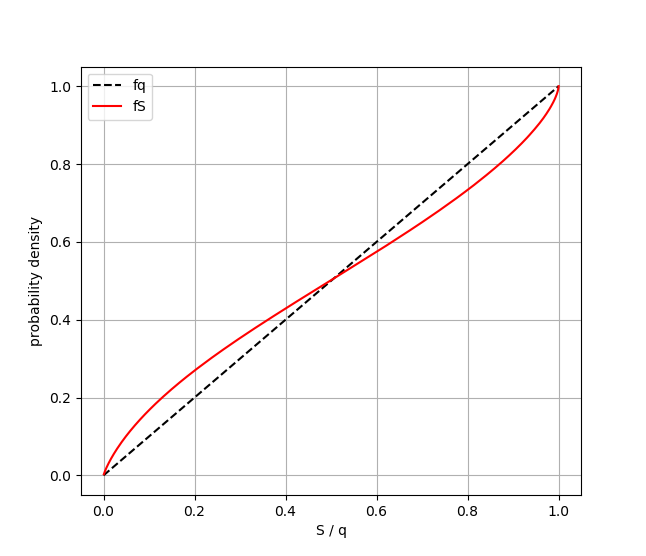

# BinaryMassFunction
The modified mass function was introduced by [Shahaf, Mazeh and Faigler (2017)](https://ui.adsabs.harvard.edu/abs/2017MNRAS.472.4497S/abstract). It's main advantage 
is that its distribution mimics the shape of the mass-ratio distribution for samples of single-lined spectroscopic binaries.

## ModifiedMassFunction.py
Contains the BinaryMassFunction class, with the following methods:
  1) calc_y - calculates the modified mass function given the binary
              orbital parameters.
  2) calc_q_minimum - calculates the minimal mass-ratio possible for a
              given value of reduced mass function.
  3) calc_S - calculates the modified mass function for a list of given
              list of reduced mass function values.
>A complete description appears in the header of each method.

These methods can be used to calculate the modified mass function for a sample of single-lined binaries. 

* Example:
Calculate the reduced mass function for three binaries with given P and K, assuming e=0 and M1=1, and calculate the modified mass function
```python
from ModifiedMassFunction import BinaryMassFunction
data = BinaryMassFunction().calc_y(P=[10.,12.,1.17], K=[0.5, 1.17, 2.])
data.calc_S()
```

## Sdistribution.py
The purpose of this routine is to demonstate the distribution of the modified mass function, fS. Detailed calculation may require some modification to the integration tolerance and grid density. In order for the fS distribution to be normalized so must be the input mass-ratio distribution. 

* Example: Plot the modified mass function distribution of a linearly increasing (not normalized) mass-ratio distribution. 
```python
import Sdistribution as SD
MRD = lambda x: x
fS, S = SD.calc_fS(MRD, PlotFlag=True)
```

